# Tổng hợp bài ảnh và code chạy các bài tập LT MOBILE
## Thông tin sinh viên
- Họ tên: Nguyễn Thế Hiệp
- MSSV: 23810310252
- Lớp: D18CNPM4

## Kết quả chạy

# Nhật ký thực hành React Native

| Bài tập | Ảnh 1 | Ảnh 2 | Ảnh 3 | Ảnh 4 | Ảnh 5 | Ảnh 6 | Ảnh 7 | Ảnh 8 | Ảnh 9 | Ảnh 10 | Ảnh 11 | Ảnh 12 | Ảnh 13 | Ảnh 14 | Ảnh 15 | Ảnh 16 | Video Demo |
|--------|-------|-------|-------|-------|-------|-------|-------|-------|-------|-------|-------|-------|-------|-------|-------|-------|------------|
| Thực hành 11/04/2026 - 17/04/2026 - 19/04/2026 - 20/04/2026 (N1): HOÀN THIỆN NECTAR APP (P5) SỬ DỤNG ASYNCSTORAGE : Nectar App |  |  | 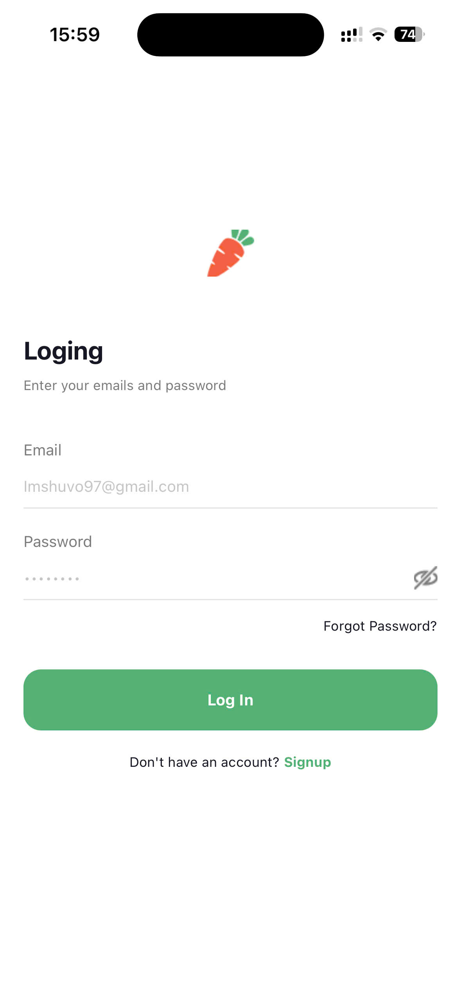 |  | 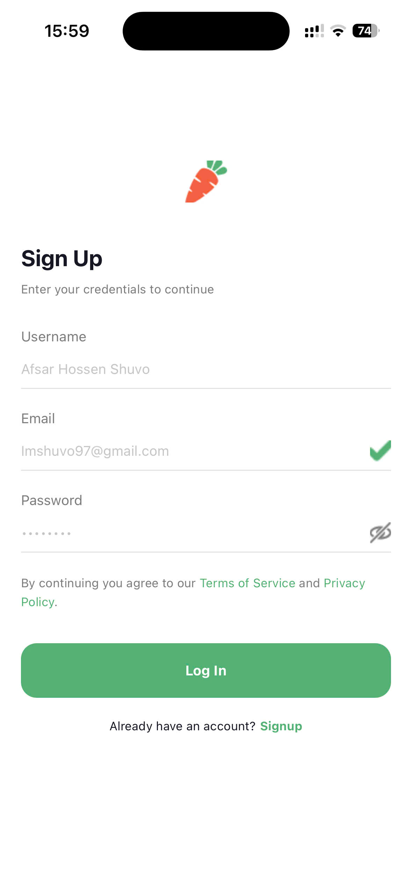 | 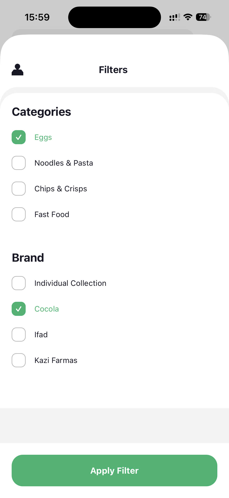 | 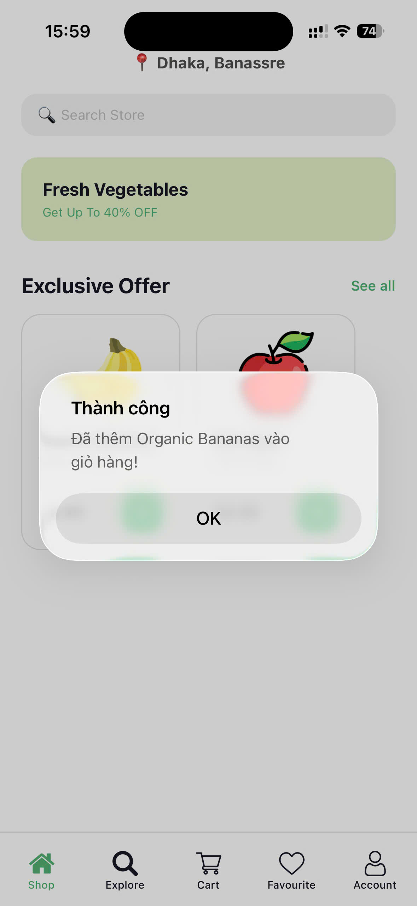 | 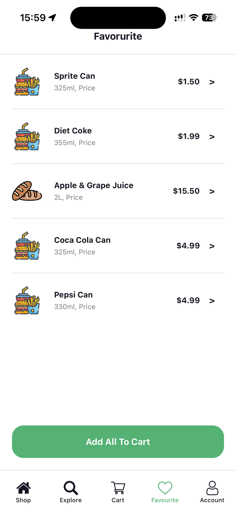 | 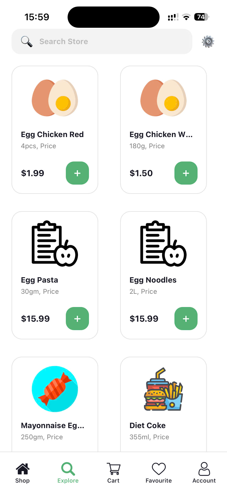 | 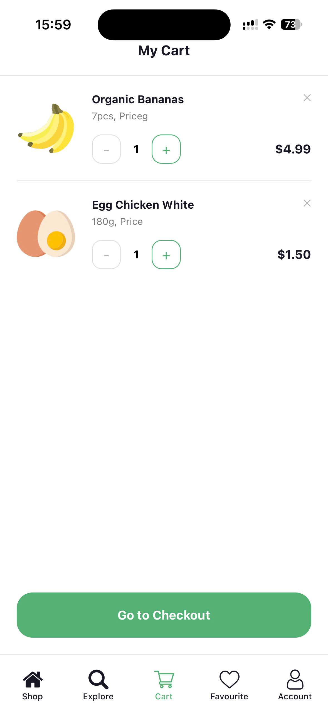 | 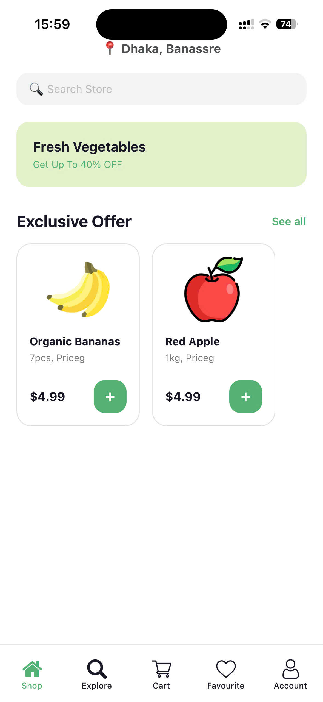 | 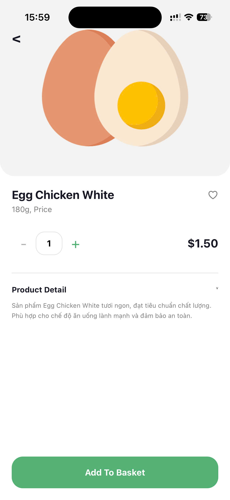 |  | 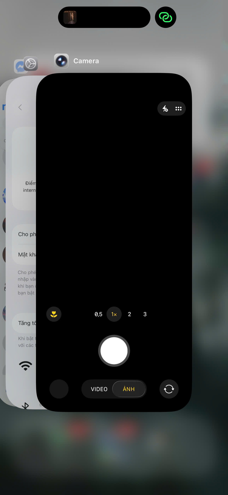 | 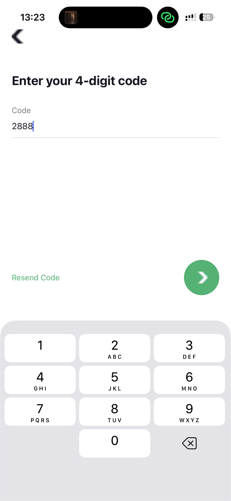 | 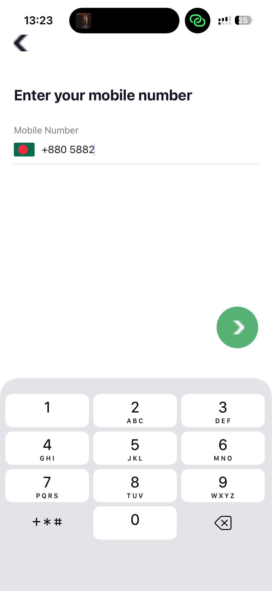 | <a href="https://drive.google.com/file/d/14A6FGqmn9zOJ0LMY8pBbRZLmaVBaPKOI/view" target="_blank">Xem Video Demo</a> |

### Trả Lời 3 câu hỏi Câu hỏi ôn tập: AsyncStorage & Quản lý State

**1. AsyncStorage hoạt động như thế nào?**
- AsyncStorage là một hệ thống lưu trữ dữ liệu cục bộ (trên bộ nhớ thiết bị), hoạt động bất đồng bộ (asynchronous) theo mô hình **Key-Value** (Khóa - Giá trị). 
- Nó chỉ có thể lưu trữ dữ liệu dưới dạng chuỗi (String). Do đó, khi muốn lưu các kiểu dữ liệu phức tạp như Object hay Array, ta phải ép kiểu thành chuỗi bằng `JSON.stringify()` và dịch ngược lại bằng `JSON.parse()` khi lấy dữ liệu ra.

**2. Vì sao dùng AsyncStorage thay vì biến state?**
- **State (`useState`)** lưu dữ liệu tạm thời trên RAM. Khi reload hoặc tắt ứng dụng, toàn bộ state sẽ bị xóa sạch.
- **AsyncStorage** lưu dữ liệu vật lý xuống ổ cứng của thiết bị (Persistent Storage). Dữ liệu sẽ tồn tại mãi mãi cho đến khi bị xóa đi, giúp ứng dụng giữ được trạng thái ngay cả khi tắt app (như tính năng duy trì đăng nhập, lưu giỏ hàng, lưu cài đặt người dùng...).

**3. So sánh AsyncStorage với Context API**
Hai khái niệm này không thay thế cho nhau mà bổ trợ cho nhau:
- **Context API:** Là công cụ để **chia sẻ dữ liệu** (Global State) giữa nhiều màn hình/component một cách tức thì trong lúc app đang chạy. Tốc độ đọc/ghi cực nhanh nhưng tắt app là mất dữ liệu.
- **AsyncStorage:** Là công cụ để **lưu trữ dữ liệu** lâu dài. Tốc độ đọc/ghi chậm hơn vì phải thao tác với ổ cứng.
- **Cách kết hợp hoàn hảo:** Khi mở app, đọc dữ liệu từ `AsyncStorage` và nạp vào `Context API` để sử dụng. Trong lúc dùng app, nếu có thay đổi (ví dụ: thêm vào giỏ hàng), hãy cập nhật `Context API` để UI đổi ngay lập tức, đồng thời lưu ngầm xuống `AsyncStorage` để không bị mất vào lần mở app sau.